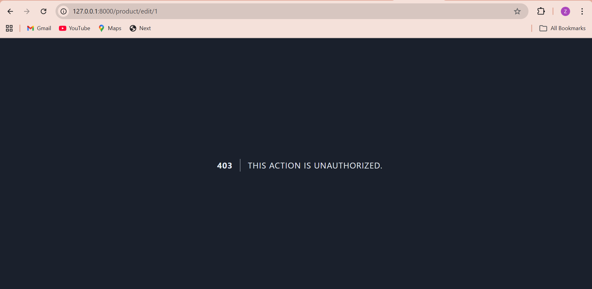

# Pertemuan 5: Otorisasi (Authorization) - Role, Gate, dan Policy

### 1. Implementasi Gate (manage-product)

### 2. Tampilan Akun Admin (dapat melihat tombol Delete untuk semua produk)

### 3. Policy: Tombol Edit & Delete hanya muncul untuk produk milik sendiri

### 4. Database sebelum ubah role

### 5. Ubah role user menjadi admin

### 6. Database setelah ubah role

### 7. Policy: Pengguna biasa akan menerima error 403 ketika mencoba mengedit produk yang bukan miliknya.

