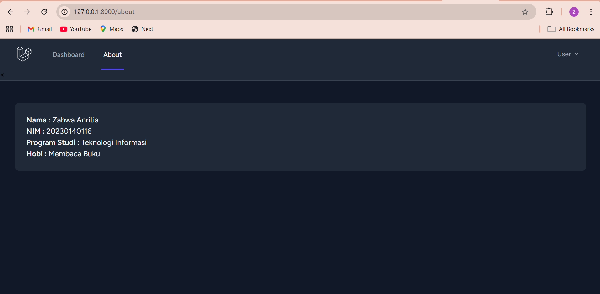
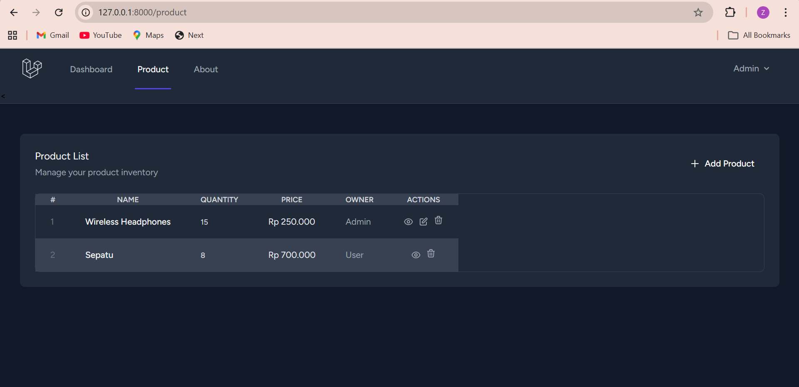
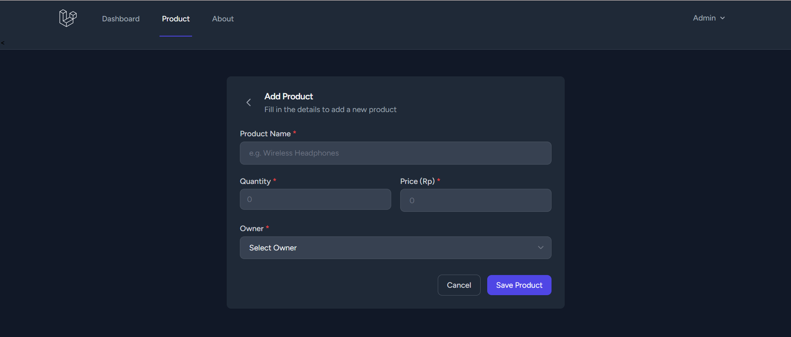
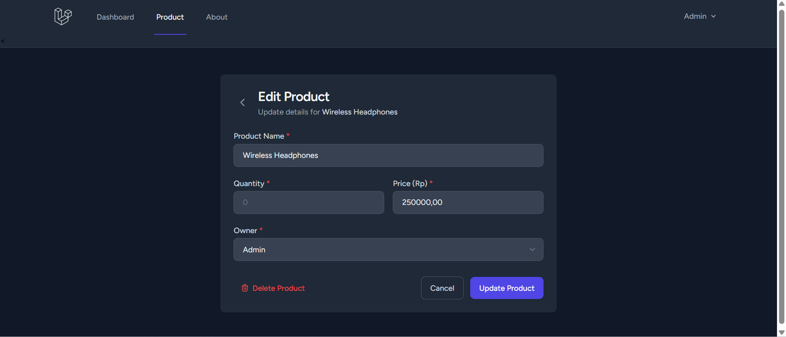
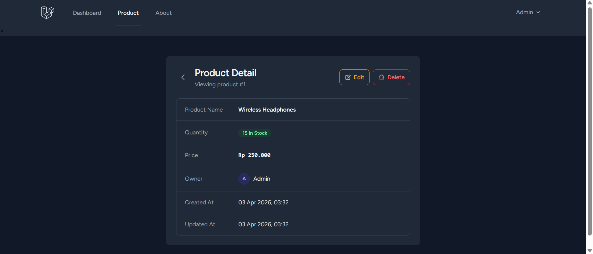
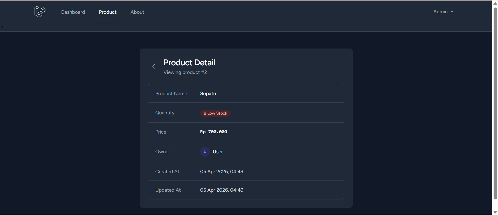
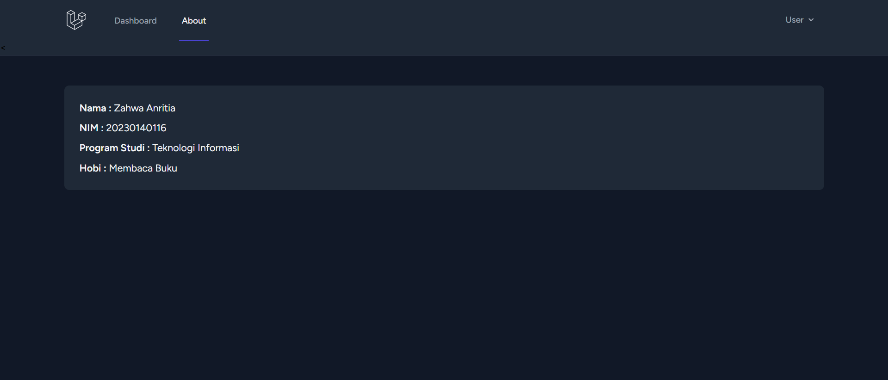
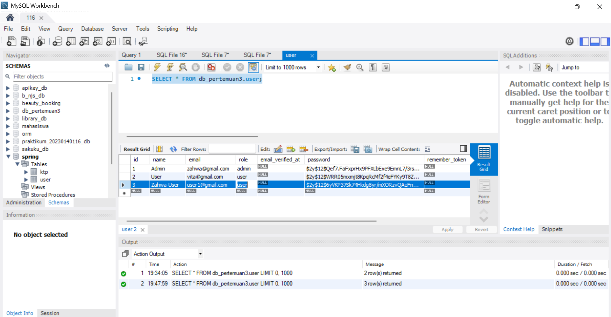
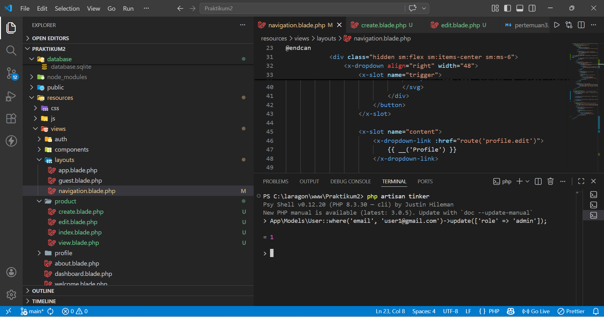
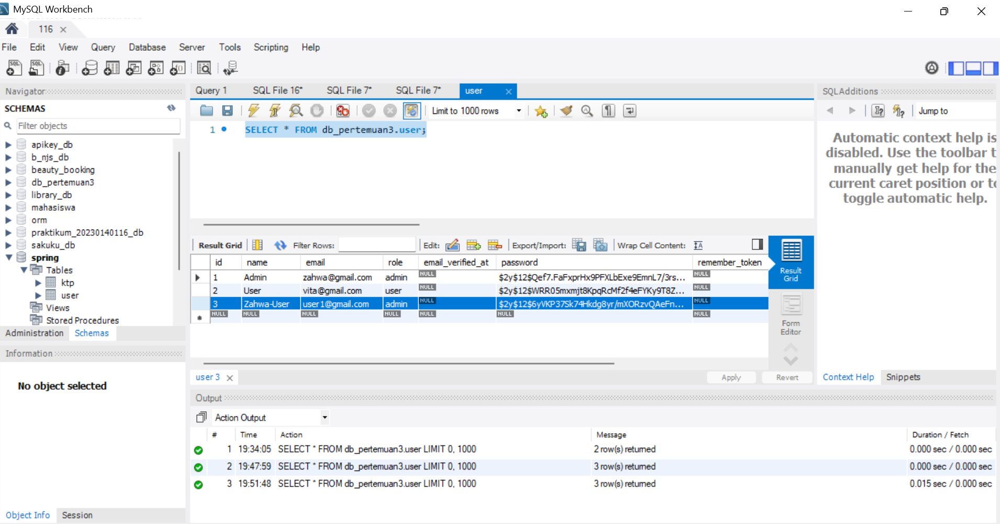

# Pertemuan 5: Otorisasi (Authorization) - Role, Gate, dan Policy

### 1. Implementasi Gate (manage-product)

### 2. Tampilan Akun Admin 

### 3. Tampilan akun user

### 4. Database sebelum ubah role

### 5. Ubah role user menjadi admin

### 6. Database setelah ubah role

