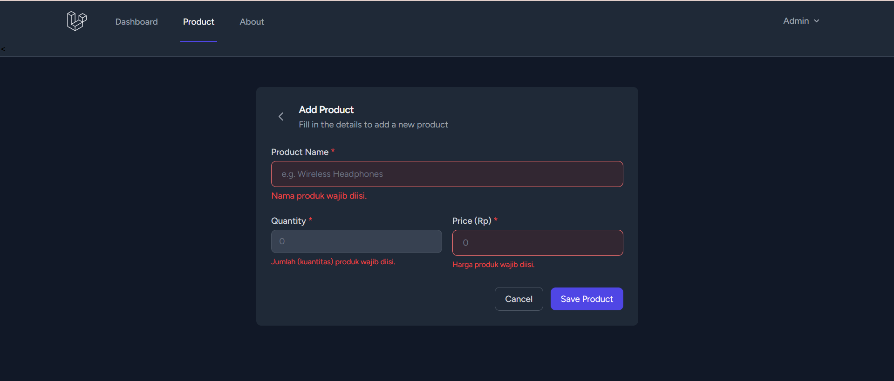
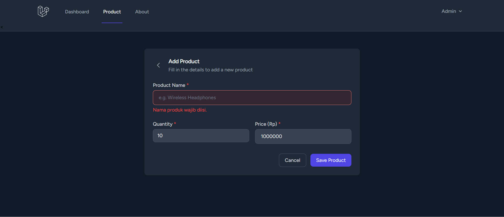
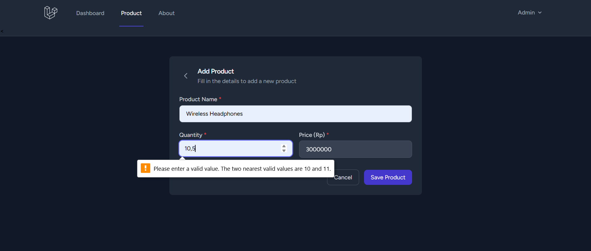
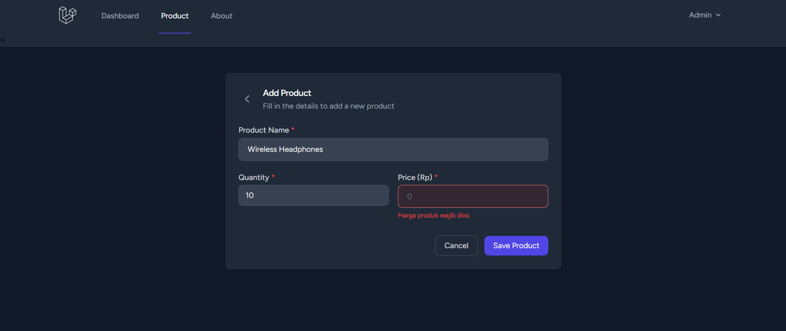
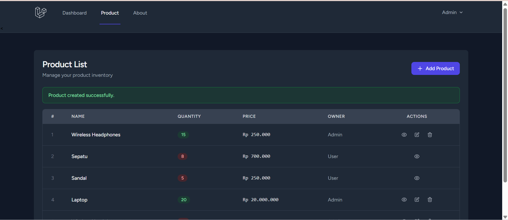

# Praktikum Pertemuan 6: Validasi Laravel

### 1. Validasi Semua Kosong

### 2.  Validasi Nama Kosong

### 3. Validasi Quantity Kosong

### 4. Validasi Harga Kosong

### 5.  Bukti Berhasil Menyimpan Data

