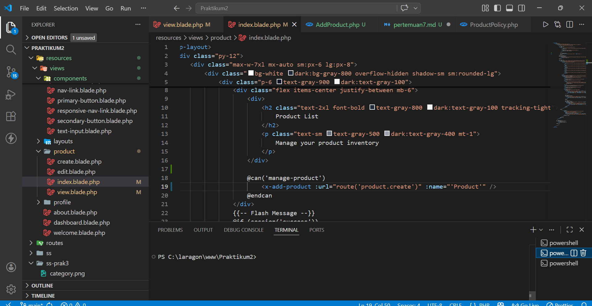
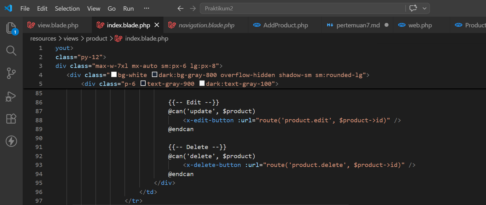
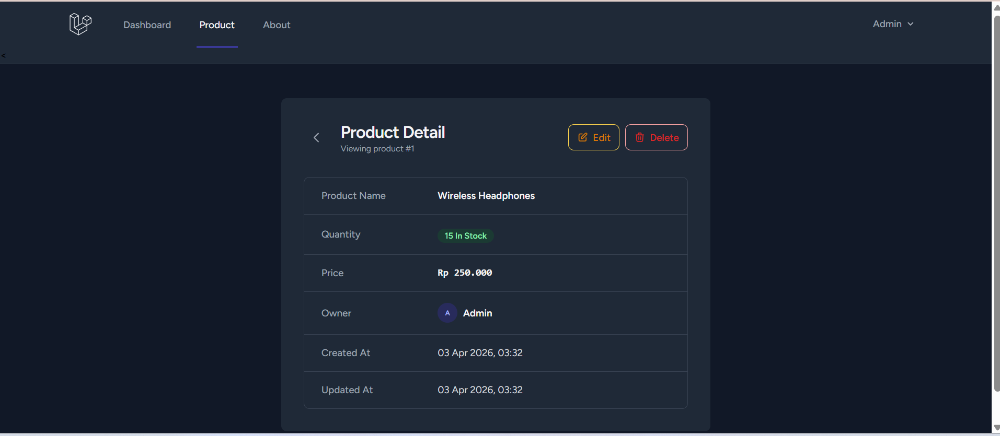

# Praktikum Pertemuan 7: Component Berjalan

### 1. Component Add Product

##### Membuat View Component \resources\views\components\add-product.blade.php

### 2. Component Edit Product

###### Membuat View Component \resources\views\components\edit-button.blade.php

### 3. Component delete Product

##### Membuat View Component \resources\views\components\delete-button.blade.php

##### Cara Menggunakan Component \resources\views\product\index.blade.php

##### tampilan detail
